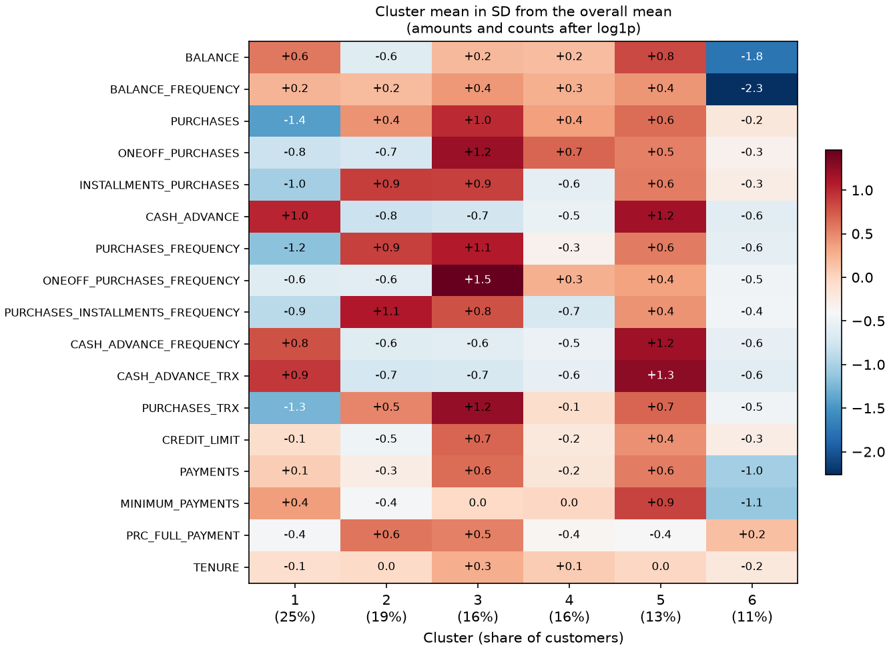

# Credit card customer segmentation

Which credit card holders spend, take cash advances and repay in the same way, and how many segments does the data support?

## Results

Run on 2026-09-26. KMeans on 8,950 card holders, with the 17 behaviour columns reduced by PCA to 8 components (91.5% of variance). There are no labels, so there is no baseline model. Silhouette is computed in PCA space (on the 8 kept components). Stability is the mean and the standard deviation of the pairwise adjusted Rand indexes over the 780 pairs of KMeans refits on 40 bootstrap resamples.

Choosing k:

| k | Inertia | Silhouette (PCA space) | Stability (mean ARI) | Stability (SD of pairwise ARIs) | Stability (worst pair) | Smallest cluster (%) |
| --- | ---: | ---: | ---: | ---: | ---: | ---: |
| 2 | 100,416 | 0.274 | 0.977 | 0.012 | 0.933 | 35.4 |
| 3 | 82,920 | 0.246 | 0.958 | 0.017 | 0.897 | 32.0 |
| 4 | 73,850 | 0.239 | 0.767 | 0.204 | 0.477 | 17.3 |
| 5 | 65,523 | 0.243 | 0.937 | 0.028 | 0.840 | 14.6 |
| 6 | 59,618 | 0.242 | 0.957 | 0.011 | 0.926 | 11.3 |
| 7 | 55,873 | 0.246 | 0.880 | 0.096 | 0.700 | 5.5 |
| 8 | 52,494 | 0.240 | 0.893 | 0.100 | 0.530 | 4.6 |
| 9 | 49,584 | 0.207 | 0.892 | 0.095 | 0.646 | 4.6 |
| 10 | 46,976 | 0.208 | 0.918 | 0.047 | 0.665 | 4.5 |

Clusters at k = 6:

| Cluster | Customers | Share (%) | Label |
| ---: | ---: | ---: | --- |
| 1 | 2,260 | 25.3 | High cash advances, low purchase frequency, low instalment purchases |
| 2 | 1,673 | 18.7 | High instalment purchases, high purchase frequency, low cash advances |
| 3 | 1,423 | 15.9 | High one-off purchases, high purchase frequency, high instalment purchases |
| 4 | 1,388 | 15.5 | High one-off purchases, low instalment purchases, low cash advances |
| 5 | 1,197 | 13.4 | High cash advances, high balance, high purchase frequency, high payments |
| 6 | 1,009 | 11.3 | Low balance-update frequency, low balance, low payments |



Per-cluster means in original units (including median-filled values), the share of filled `MINIMUM_PAYMENTS` values, the k = 3 comparison, PCA details and package versions are in [results/metrics.md](results/metrics.md). Silhouette and stability against k are plotted in [results/k_selection.png](results/k_selection.png).

## Data

- Source: Kaggle, "Credit Card Dataset for Clustering" (arjunbhasin2013/ccdata), <https://www.kaggle.com/datasets/arjunbhasin2013/ccdata>
- License: CC0: Public Domain
- Size: 8,950 rows (one per card holder) x 18 columns: `CUST_ID` plus 17 numeric behaviour columns
- How to get it: sign in to Kaggle, open the page above, click Download, unzip the archive and copy `CC GENERAL.csv` to `data/CC GENERAL.csv` (the script's default `--data` path). With the Kaggle CLI set up, `kaggle datasets download -d arjunbhasin2013/ccdata -p data --unzip` does the same.
- The run above used `data/CC GENERAL.csv`. The script also reads an `.xlsx` export of the same table.
- Columns used and how each one is treated: [data/README.md](data/README.md). Nothing under `data/` except that file is committed.

## Approach

- Features: the 17 numeric columns; `CUST_ID` is the index.
- Missing `CREDIT_LIMIT` (1 row) is filled with its median (3,000.00). Missing `MINIMUM_PAYMENTS` (313 rows) is filled with its own median (312.34). A flag marks the filled `MINIMUM_PAYMENTS` rows for the profile table only; it is not a clustering feature.
- 240 of those 313 `MINIMUM_PAYMENTS` gaps are accounts with `PAYMENTS` = 0, so the median fill overstates their minimum payment.
- Ratio and frequency columns, including `PRC_FULL_PAYMENT`, are clipped to [0, 1] (8 `CASH_ADVANCE_FREQUENCY` values were above 1).
- log1p on the 10 skewed money and count columns only. Frequency columns, `PRC_FULL_PAYMENT` and `TENURE` are left as they are after the clip.
- StandardScaler, then PCA keeping 90% of the variance (8 components, 91.5% explained). Several columns repeat each other: `PURCHASES` equals one-off plus instalment purchases in 99.8% of rows.
- KMeans (`n_init=20`, `random_state=42`) for k = 2 to 10, scored by inertia, silhouette in PCA space, and bootstrap stability (40 resamples; mean and SD of the 780 pairwise ARIs).
- Split: none. Every row is used. The scaler and PCA are fitted on all 8,950 rows.
- Labels come from a fixed rule in the code: up to 3 of a set of amount and frequency columns (listed in `results/metrics.md`) whose cluster mean, after log1p and scaling, is at least 0.5 SD from the overall mean; a fourth term is added when the next |z| is within 0.05 of the third.

## What I found

- Silhouette in PCA space is weak at every k (0.274 at k = 2, between 0.239 and 0.246 for k = 3 to 8), so it could not choose k for me. I chose by stability and by whether the clusters read clearly.
- k = 2 has the highest stability (mean pairwise ARI 0.977, SD of pairwise ARIs 0.012) but only a two-way split (smallest cluster 35.4%), which I read as too coarse to separate cash-advance use from purchase mix.
- k = 3 and k = 6 are a tie on stability (mean ARI 0.958 vs 0.957; SD 0.017 vs 0.011). I picked k = 6 because it splits behaviours that k = 3 merges, not because of that 0.001 gap. k = 4 is unstable (mean ARI 0.767, SD 0.204). From k = 7 up the smallest cluster is 5.5% or less.
- At k = 3 I see one buyer segment (35.9%) with high one-off and high instalment purchases (means 1,422 and 872). k = 6 splits that into people who buy both (cluster 3, 15.9%; one-off 2,243, instalment 1,181), one-off buyers (cluster 4, 15.5%; one-off 640, instalment 64), and cash-advance users who also buy (cluster 5, 13.4%; cash advance 2,906, purchases 1,434). The cash-advance-only segment is cluster 1 (25.3%; purchases 24, cash advance 2,103).
- Cluster 6 (11.3%) looks to me like little-used accounts (balance-update frequency 0.34 against 0.88 overall), and 21.4% of its `MINIMUM_PAYMENTS` values are filled medians, against 3.5% overall.

## Limitations

- A silhouette of 0.242 at k = 6 (PCA space) means the clusters are regions of a continuum rather than separate segments; many customers sit near a boundary, and the labels describe cluster averages.
- The source does not name the currency, and it says only that the behaviour is over the last 6 months with no dates, so I cannot check whether the segments hold over time. `TENURE` in the file runs from 6 to 12 months (7,584 of 8,950 rows are 12).
- 240 of the 313 missing `MINIMUM_PAYMENTS` rows are accounts with `PAYMENTS` = 0, so filling those with the column median (312.34) overstates their minimum payment. The profile-table means include these filled values; that matters most for cluster 6 (21.4% filled).
- The silhouette and stability scores have no null reference: KMeans can look stable on unstructured data.

## How to run

Python 3.13. Put the data file in `data/` first (see Data).

Windows (PowerShell):

```powershell
py -3.13 -m venv .venv
.venv\Scripts\python.exe -m pip install -r requirements.txt
.venv\Scripts\python.exe src\customer_segmentation.py --data "data\CC GENERAL.csv"
```

bash:

```bash
python3.13 -m venv .venv
source .venv/bin/activate
pip install -r requirements.txt
python src/customer_segmentation.py --data "data/CC GENERAL.csv"
```

With an `.xlsx` export, pass `--data data/CC_GENERAL.xlsx` instead. The script prints the row count after each cleaning step and the tables above, and writes `results/metrics.md`, `results/k_selection.png` and `results/cluster_profiles.png`. Options: `--k` (clusters in the final model, default 6), `--compare-k` (second k to cross-tabulate, default 3), `--n-boot` (bootstrap resamples, default 40), `--results-dir` (default `results`). The last full run took 559 s.

Tests and lint (the tests build a small synthetic dataset and need no download):

```bash
pip install -r requirements-dev.txt
ruff check .
pytest -q
```

## Context

Built for a PGDBA course project in 2022; rewritten in 2026.
